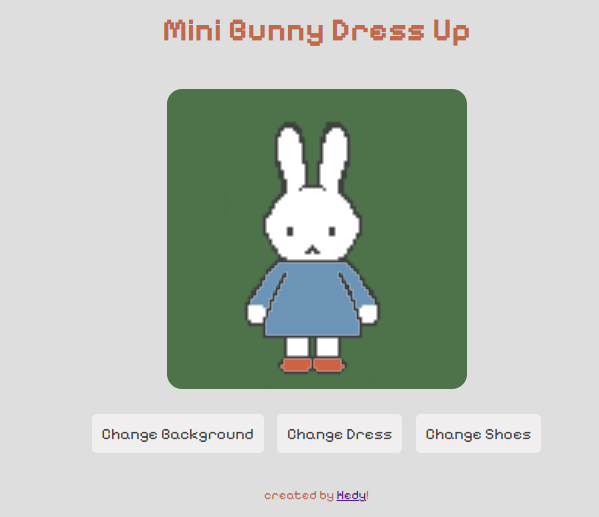

#  Mini Bunny Dress-Up Game

Welcome to my **Mini Bunny Dress-Up Game** — a playful little web experiment where you can change the background, dress, and shoes of a bunny character by clicking buttons!


---

##  About This Project

This project was created as a **personal front-end experiment**. The goal wasn't to build something perfect or production-ready, but rather to:

- Get more comfortable with **HTML**, **CSS**, and **JavaScript**
- Understand how images can be layered and dynamically changed
- Explore interactive UI design in a lightweight, browser-based way
- Have fun building something cute and creative!

---

## Inspiration

This project was inspired by **Nashallery** on TikTok, whose super adorable and creative dress-up game inspired me to try and create my own!~

You can find their content here: [@nashallery on TikTok](https://www.tiktok.com/@nashallery)

---

## 🛠 How It Works

- The bunny character is composed of layered transparent PNGs: a base image, background, outfit, and shoes.
- Clicking the buttons cycles through different images for each category.
- Images are swapped using JavaScript and `querySelector`.
- Everything is styled with simple CSS and a pixel-style Google font.

---

##  Features

- Click buttons to cycle through:
  -  Backgrounds
  -  Dresses
  -  Shoes
- Uses `Pixelify Sans` from Google Fonts for a fun retro look
- Lightweight and runs in the browser with no frameworks

---

##  How to Run It

1. Clone or download the repository
2. Make sure all image files are in the correct `assets/images/` folder
3. Open `index.html` in any modern browser
4. Click buttons to dress up the bunny!

---

## Folder Structure

```
project-root/
├── index.html
├── assets/
│   ├── styles.css
│   └── images/
│       ├── base.png
│       ├── green-bg.png
│       ├── blue-dress.png
│       ├── orange-shoes.png
│       └── ...other image files
└── README.md
```

---

## What I Learned

- Basics of DOM manipulation using plain JavaScript
- How to layer and align transparent images
- CSS layout and positioning with `z-index`
- Simple ways to create interactive elements with buttons and loops

---

## Future Ideas

- Add accessories (hats, bows, glasses)
- Save outfit selection using `localStorage`
- Add sound effects or music

---

## ✨ Final Note

This is just a **fun and simple experiment** while learning front-end development. I hope you enjoy :~) <3
